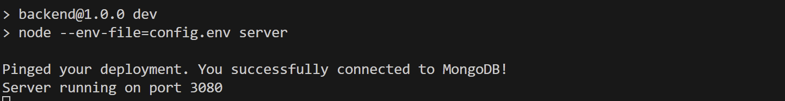

# CodeLlamaAcademy
Team Members: Emma Park, Hejia Qiu, Jeffrey Zha, Yining Zhong  

# Project Description
CodeLlamaAcademy is a simple web application that allows users to test their code interpretation skill.  

This application will have multiple frontend elements and backend elements that communicate with each other. 
The application provides a sign-up page for users to create an account and log in by agreeing to the consent form.
After successfully logging into the application, the user will see a menu page, and they can navigate to either start a new set of code comprehension exercises or view their history data by clicking on the corresponding button. 
If the user chooses to start a new set of exercises, the application will display a simple function and prompt the user for a response. 
The response would then be reformatted to be used in an API call to Ollama from the backend. 
Ollama will proceed to use a LLM to generate code based on user input and communicate back to the backend.
The generated code will be run against a set of pre-written tests to determine if the generated code is functionally equivalent to the question. 
If the test results are all correct the user will move onto the next question. Otherwise, test results and generated code will be provided to the user to aid in subsequent tries. 
After finishing the exercises, they will be directed back to the menu. 
The application also will persist all relevant data for each trial for users such as questions completed, date of completion, and time used to assist in future analysis. 
The users’ data will be displayed in the history summary page and can be seen by themselves if they navigate to the history summary page at the menu. 
## Unique features
- Changing the difficulty levels
- Performance review
- Admin mode
- Change Username
- Skip button

## Model used
- Ollama's mistral model

# Instruction on running this APP
Please choose a way you want to run the application and follow the corresponding instructions below step by step

## Docker Compose
- Please start the Docker Desktop engine
- Please make sure there is nothing running at port 3000 and port 3080 on your local host. If you have Ollama running, please stop it by quitting it. 
- Please navigate to the root folder of this project, which is Project-Groups-01-Lab-A
- Please type "docker compose build" in the terminal and press enter, and the images will start to build. You should be able to see related information and progress in the terminal (it may takes a minute or so for the first time)
.png>)
- After "docker compose build" command is finished, please type "docker compose up -d" in the terminal (you should still be in Project-Groups-01-Lab-A directory) and press enter. You should be able to see the related information and progress in the terminal. If you don't have Ollama and Ollama-pull images before, it may take a while for the thing to be pulled (time spent ranges from 30 seconds to 3 minute during manual testing). After all the images are ready, the containers will start and the ollama pull will start to pull the model (takes about 160 seconds - 300 seconds during manual testing). During this process, the terminal looks something like this (might vary from computers to computers):
.png>)
After waiting for a while for Ollama pull to finish pulling the model and exiting, if you see something like this: 
.png>)
in the terminal, this means the application is running successfully. (NOTE: if this is not the first time you build it, the things showing in the terminal may be slightly different, such as the network part may not show up, but it should be similar.)
- After the container for backend, frontend, and ollama succesfully runs in the docker and the ollama-pull container exits after it finishes its job (you can open the docker desktop and go to container to confirm that the frontend, backend, and ollama are all running), please open http://localhost:3000 in your browser to start the application (or you can click the the port link in Docker Desktop for the frontend)
## NOTE
- if you go to local host 3000 too quickly before everything starts properly, the thing may not be fully loaded yet and you may see a page that says something like "this page isn't working", but if you wait for a seconds or so, everything should be loaded successfully and you don't need to take any action 
- if you have already did "docker compose build" before, you do not need to redo it every time when you want to run the app. You can jump to "docker compose up -d" step
- if this is not the first time for you to run this project (which means the container is already in docker and the ollama-pull has done its work when you first time use the app), when you do "docker compose up -d", ollama-pull will start running but quit very quickly because you already have the model pulled. You can just start using the application after it quits and the backend start
- We have done multiple manual testings for docker, and during one of the manual testing, it takes really long for ollama-pull to finish (almost 20 minutes). After restarting the computer, we follow the same precedure as stated in the above instructions, and it works super quick (about 160 seconds). Based on all manual tests we have done, in most cases, it should only take about 160s to 300s to finish pulling. However, we just want to make a note here that this strange situation does occured once during testing. It might be an individual computer problem or a one time thing, but we cannot be sure about the cause. If this happens, please restart the computer to see if it can increase the speed.

## Running using npm command
- To run using npm command, there are two env files needed. However, since it's unsafe to publish env files to github, please inform us about the situation so we can provide necessary files or information to run it using npm command. Without env file, the thing will not run as intended
- If the env file is setted up, please follow the steps below
- Please stop running the app using docker if you are running it
- Please download Ollama from https://ollama.com/ 
- Please start running your Ollama on your machine 
(to check if it's running, please go to http://localhost:11434, if there is a text says Ollama is running then Ollama is running)
- Please type "ollama pull mistral" on the terminal and click enter. Please wait for the model pulling to complete
- After that, please navigate to the backend folder of this project, which is Project-Groups-01-Lab-A/backend. Please type "npm install" to install the dependencies. Then, please type "npm run dev", and the backend should start and the terminal will display something like this:

- Please navigate to the frontend folder of this project, which is Project-Groups-01-Lab-A/frontend. Please type "npm install" to install the dependencies. Please type "npm start", and the frontend should run and be opened in a browser (at http://localhost:3000). You should be able to start using the application now. 

## NOTE
If you want to have a try for each way of running it, please check the important notes section at the end of the README, which may be helpful for you to shift between the two ways successfully

# Instruction on viewing tests for this APP through HTML in browser
## Steps
- Link to tests: Inside <b>Project-Groups-01-Lab-A</b> folder, there is a folder called <b>test</b>. Inside folder <b>test</b>, there is a file called <b>index.html</b> that you can click to open the file to view tests
- Please make sure the backend and ollama is running (both docker and npm command ways of runing the application can work,  so please choose one from the two) when running the tests in browser.
- For backend tests, there are six sections as presented on HTML: Extractor (test for the function that extract the generated code from ollama response), Answers (test for the API handling process when the frontend send to user results to the backend to trigger the process of calling ollama), Question (test for the getting the problem bank from the database),Test Get, Post, Patch to Database(test getting user id, adding new user, and adding new results at the backend), Test the test for generated code (test whether we evaluate the correctness of the generated code of ollama correctly), and Calculation Helpers (test the function that we used to calculate user scores and other data).
- For the frontend, we did manual testing as listed in the HTML
## NOTE:
- It may takes a while for some tests to finish executing because of the response time of Ollama, so please wait for a while utill all tests show up.
- Due to "import" statement's incompatibility with the browser Mocha tests, "Test the test for generated code" tiggers the functions we want to test through API call to avoid import statement. The functions it is testing is in sandbox.js at utils folder at the backend folder.

# Instruction on viewing extra tests for this APP through npm command at the backend
Using npm test, you will be able to see additional tests on "callOllama". This is the only test that is not included in the HTML test suite in index.html. This is because the HTML version of the test does not support export and import statement so we cannot present our tests for callOllama (this function is mostly provided by official Ollama documentation about how to make an API call to ollama). npm test can allow you to see the test on callOllama.
- Please run the application either through docker or npm command as mentioned in previous instructions
- At backend folder, please then type "npm test" at the terminal to run the tests
- The tests result will be displayed in the terminal

# Instruction on using the application
- If this is the first time you are using this application, the first page you see is the page with a logo and a term of service button. Please click the terms of service button, read the term of service, and click the checkbox at the bottom. The login button will show up beside the checkbox. If you accidentally close the term and service form, you can just click term of service button again to see the checkbox and the login button. If this is not the first time you use the application and you have previously log in recently, the first page you see may be the home page and you are already logged in. You can click "Log out" button to log out if you want, and you will be able to follow the same procedure to log in as you did before.
- After check the terms of service and click on "log in", please follow the instruction on the page to log in/sign-up. You can either do it through google account or email
- After seeing the home page, please click on "Exercise" to if you want to start do a quiz
- Please click submit to submit your answer, and note that the button will be disabled while waiting for result (which may take a while)
- If the answer is right, you will directed to the next question; otherwise, you will have a second attempt, and be provided with failed test cases and generated code. You will also be able to enter the reason of changing the answer at the second attempt
- If you enter empty answer, the question will be marked as wrong
- If you click skip button, you will be directed to the next question (if there is one), and the skipped question will be marked as wrong
- You will be able to see the score and result for all your attempts at the end of the quiz
- There are 8 questions in total, and the level of difficulty will be changing based on your performance (Starting from the easy level, if you get the question right, the next question will be at the moderate level. If you get the moderate question right, the next one will be at the hard level; otherwise, you go back to the easy level. If you get the hard question right, you remain at the hard level).
- The Performance review button on home page will take you to the performance review page
- Clicking on rows of the table at the performance review page will take you to a page where detailed information about a quiz is displayed. You can see even more detailed information about each question by clicking the corresponding row. 
- Please click "Go to the Main Page" button at performance review page or the page showed up at the end of each quiz if you want to navigate to the home page
- If you click Admin Mode button at home page, there will be a prompt that ask you about the password to admin mode. The password is "codeLlama", which will only be revealed to authorized people in practice. If you enter the correct password, you will be directed to the admin mode page, where you can see summary data for each users and aggregated data for all users. It may take a few seconds for the data to fully loaded. You can see the score trend graph of a user by clicking the row corresponding to that user. The scales score is calculated can be find in the comments in the frontend/src/helpers/calculate.js file
- If you click Profile Page button at home page, you will be able to set up or change your username. This page may load a bit slow, so if you didn't see anything at the first glance, please wait for a few seconds for it to show up
- NOTE: if you refresh or quit (click backward on the browser) at the middle of a quiz, no result is going to be recorded

# Data in database
- Our project used MongoDB for data persistence
- There are two databases we created: performance review and problem bank
- Inside performance review, there is a collection called results that store users' data. Each user has
user id, results, and username field. The "results" contains information for all quizzes the user has completed. For each question in a quiz, 
question number, question, answer, reason of changing answer at 2nd attempt, pass or fail, attempt number, quiz start time, question end time, difficulty Level,
generated code, failed test cases are all recorded
- There are three collections in the problem bank database: easy, medium, hard

# Important notes for troubleshooting
- If you want to shift from running using Docker to running using npm command, please stop the Docker containers (i.e. all four relevant containers for this project need to be stopped) for the application before you run the npm command otherwise the port will not be freed for use. Also, after stopping the containers, please check that the ollama is running locally (not in Docker), and restart it if you somehow stopped it before.
- When running using Docker, please start using the application only when the image for ollama, frontend, and backend all start running. The ollama-pull service will stopped after it finishes its job, so when the other three images is running, its status should (correctly) be exited. If the ollama-pull is still running, please wait for it to finish its work and do not start to use the application. Closing other application on your machine before starting this one may improve the speed.
- Each of the questions in exercise may takes 30 seconds to 3 minutes to get back a result based on our manual testings. If it takes way too long, closing other applications, restarting the app, or even restarting the computer may increase the responding speed.

